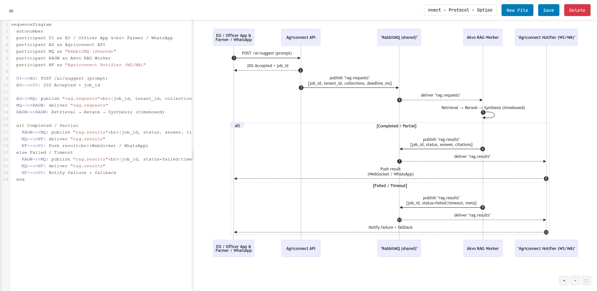
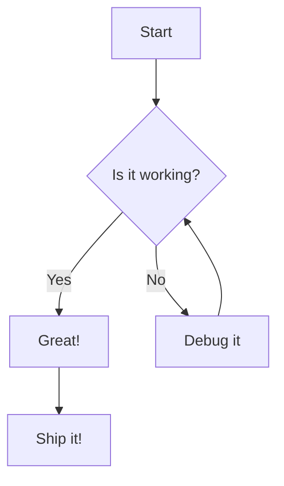

# Mermaid Live Editor

A modern, feature-rich live editor for Mermaid diagrams with Docker support. Create, edit, and preview Mermaid diagrams with syntax highlighting, zoom controls, and file management.



## Features

### 🎨 **Modern Interface**
- Clean, responsive design with collapsible sidebar
- Side-by-side code editor and live preview
- Resizable panels to customize your workspace
- Header navigation with all essential controls

### 📝 **Advanced Editor**
- Syntax highlighting with CodeMirror
- Line numbers and bracket matching
- Horizontal and vertical scrolling
- Auto-indentation and code formatting

### 🔍 **Preview Controls**
- Zoom in/out with mouse wheel or buttons
- Pan by clicking and dragging
- Reset zoom to fit view
- Real-time preview updates

### 💾 **File Management**
- Save and load multiple diagram files
- File list with creation timestamps
- Delete files with confirmation
- Persistent storage with JSON backend

### 🐳 **Docker Ready**
- One-command deployment with Docker Compose
- Runs on localhost:9000
- Volume mounting for persistent data
- Production-ready Flask backend

## Quick Start

### Prerequisites
- Docker and Docker Compose installed on your system

### Installation

1. Clone the repository:
```bash
git clone https://github.com/dedenbangkit/mermaid-live-editor.git
cd mermaid-live-editor
```

2. Start the application:
```bash
docker compose up
```

3. Open your browser and navigate to:
```
http://localhost:9000
```

That's it! You're ready to create beautiful Mermaid diagrams.

## Usage

### Creating Diagrams
1. Click the hamburger menu (☰) to open the file list
2. Click **New File** to create a new diagram
3. Enter your diagram name in the text field
4. Write your Mermaid code in the editor
5. Watch the live preview update automatically
6. Click **Save** to store your diagram

### Managing Files
- **Open**: Click any file in the sidebar to open it
- **Save**: Click the Save button or use the name field to rename
- **Delete**: Click the Delete button to remove the current file
- **New**: Click New File to create a fresh diagram

### Navigation
- **Zoom**: Use the +/- buttons or mouse wheel in the preview
- **Pan**: Click and drag in the preview area
- **Reset**: Click the reset button (⛶) to fit the diagram
- **Resize**: Drag the divider between code and preview panels

## Supported Mermaid Diagrams

This editor supports all Mermaid diagram types:

- **Flowcharts** - Decision trees and process flows
- **Sequence Diagrams** - Interaction timelines
- **Gantt Charts** - Project timelines
- **Class Diagrams** - Object-oriented structures
- **State Diagrams** - State machines
- **Entity Relationship Diagrams** - Database schemas
- **User Journey** - User experience flows
- **Git Graphs** - Version control workflows
- **Pie Charts** - Data visualization
- **Requirement Diagrams** - System requirements

## Example

Here's a simple flowchart to get you started:



## Architecture

### Backend (Flask)
- **app.py**: Main Flask application
- **API Endpoints**:
  - `GET /api/files` - List all saved files
  - `GET /api/files/<id>` - Get specific file
  - `POST /api/files` - Save/create file
  - `DELETE /api/files/<id>` - Delete file

### Frontend
- **index.html**: Single-page application
- **CodeMirror**: Syntax highlighting and editor features
- **Mermaid.js**: Diagram rendering engine
- **Vanilla JS**: No framework dependencies

### Storage
- Files stored as JSON in `/saved_files` directory
- Docker volume mounting for persistence
- Simple file-based storage (easily replaceable)

## Configuration

### Port Configuration
The default port is 9000. To change it, modify the `docker-compose.yml`:

```yaml
ports:
  - "YOUR_PORT:5000"  # Change YOUR_PORT to desired port
```

### Development Mode
For development with hot reloading:

```bash
# Install dependencies
pip install -r requirements.txt

# Run development server
python app.py
```

## Contributing

1. Fork the repository
2. Create your feature branch (`git checkout -b feature/AmazingFeature`)
3. Commit your changes (`git commit -m 'Add some AmazingFeature'`)
4. Push to the branch (`git push origin feature/AmazingFeature`)
5. Open a Pull Request

## License

This project is licensed under the MIT License - see the [LICENSE](LICENSE) file for details.

## Acknowledgments

- [Mermaid.js](https://mermaid.js.org/) - The amazing diagramming library
- [CodeMirror](https://codemirror.net/) - Excellent code editor component
- [Flask](https://flask.palletsprojects.com/) - Lightweight Python web framework

## Support

If you find this project helpful, please consider giving it a ⭐ on GitHub!

For issues and feature requests, please use the [GitHub Issues](https://github.com/dedenbangkit/mermaid-live-editor/issues) page.