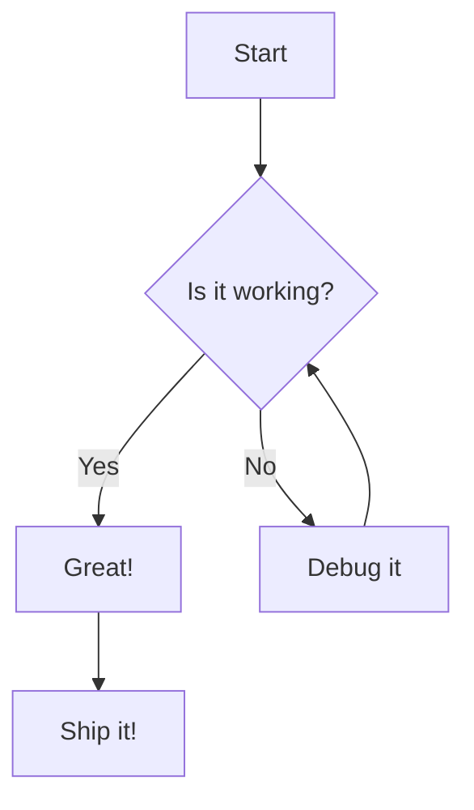

# Mermaid Live Editor

A modern, feature-rich live editor for Mermaid diagrams. Create, edit, and preview Mermaid diagrams with syntax highlighting, zoom controls, and file management - all running entirely in your browser with no backend required!

**[🚀 Live Demo](https://dedenbangkit.github.io/mermaid-live-editor/)**


## Features

### 🎨 **Modern Interface**
- Clean, responsive design with collapsible sidebar
- Side-by-side code editor and live preview
- Resizable panels to customize your workspace
- Header navigation with all essential controls

### 📝 **Advanced Editor**
- Syntax highlighting with CodeMirror
- Line numbers and bracket matching
- Horizontal and vertical scrolling
- Auto-indentation and code formatting

### 🔍 **Preview Controls**
- Zoom in/out with mouse wheel or buttons
- Pan by clicking and dragging
- Reset zoom to fit view
- Real-time preview updates

### 💾 **File Management**
- Save and load multiple diagram files
- File list with creation timestamps
- Delete files with confirmation
- Persistent storage using IndexedDB (browser storage)

### 🌐 **No Backend Required**
- Runs entirely in your browser
- All data stored locally using IndexedDB
- No server setup or installation needed
- Works offline after first load
- Can be hosted on any static file server

## Quick Start

### Option 1: Open Locally
Simply open `index.html` in your web browser. That's it!

### Option 2: Run with Python HTTP Server
```bash
# Clone the repository
git clone https://github.com/dedenbangkit/mermaid-live-editor.git
cd mermaid-live-editor

# Start a simple HTTP server (Python 3)
python -m http.server 8000

# Or with Python 2
python -m SimpleHTTPServer 8000
```

Then open your browser and navigate to: `http://localhost:8000`

### Option 3: Use with Live Server (VS Code)
1. Install the "Live Server" extension in VS Code
2. Right-click on `index.html`
3. Select "Open with Live Server"

### Option 4: Deploy to Static Hosting
This application can be deployed to any static hosting service:
- **GitHub Pages**: Push to a repository and enable GitHub Pages
- **Netlify**: Drag and drop the folder to Netlify
- **Vercel**: Deploy with a single command
- **Cloudflare Pages**: Connect your repository
- Or any other static hosting provider

## Usage

### Creating Diagrams
1. Click the hamburger menu (☰) to open the file list
2. Click **New File** to create a new diagram
3. Enter your diagram name in the text field
4. Write your Mermaid code in the editor
5. Watch the live preview update automatically
6. Click **Save** to store your diagram

### Managing Files
- **Open**: Click any file in the sidebar to open it
- **Save**: Click the Save button or use the name field to rename
- **Delete**: Click the Delete button to remove the current file
- **New**: Click New File to create a fresh diagram

### Navigation
- **Zoom**: Use the +/- buttons or mouse wheel in the preview
- **Pan**: Click and drag in the preview area
- **Reset**: Click the reset button (⛶) to fit the diagram
- **Resize**: Drag the divider between code and preview panels

## Supported Mermaid Diagrams

This editor supports all Mermaid diagram types:

- **Flowcharts** - Decision trees and process flows
- **Sequence Diagrams** - Interaction timelines
- **Gantt Charts** - Project timelines
- **Class Diagrams** - Object-oriented structures
- **State Diagrams** - State machines
- **Entity Relationship Diagrams** - Database schemas
- **User Journey** - User experience flows
- **Git Graphs** - Version control workflows
- **Pie Charts** - Data visualization
- **Requirement Diagrams** - System requirements

## Example

Here's a simple flowchart to get you started:



## Architecture

### Frontend-Only Application
- **index.html**: Complete single-page application with embedded CSS and JavaScript
- **CodeMirror**: Syntax highlighting and editor features
- **Mermaid.js**: Diagram rendering engine
- **IndexedDB**: Browser-based persistent storage
- **Vanilla JS**: No framework dependencies, no build process required

### Storage
- Files stored locally in your browser using IndexedDB
- Data persists across browser sessions
- Each browser/device has its own independent storage
- No server communication required

### Data Structure
Files are stored with the following structure:
```json
{
  "id": "file_timestamp",
  "name": "diagram_name",
  "content": "mermaid_code",
  "created": "ISO_8601_timestamp"
}
```

## Browser Compatibility

This application requires a browser with IndexedDB support:
- Chrome/Edge 24+
- Firefox 16+
- Safari 10+
- Opera 15+
- All modern mobile browsers

## Data Privacy

All your diagrams are stored **locally in your browser**. No data is ever sent to any server. Your diagrams stay on your device.

## Contributing

1. Fork the repository
2. Create your feature branch (`git checkout -b feature/AmazingFeature`)
3. Commit your changes (`git commit -m 'Add some AmazingFeature'`)
4. Push to the branch (`git push origin feature/AmazingFeature`)
5. Open a Pull Request

## License

This project is licensed under the MIT License - see the [LICENSE](LICENSE) file for details.

## Acknowledgments

- [Mermaid.js](https://mermaid.js.org/) - The amazing diagramming library
- [CodeMirror](https://codemirror.net/) - Excellent code editor component

## Support

If you find this project helpful, please consider giving it a ⭐ on GitHub!

For issues and feature requests, please use the [GitHub Issues](https://github.com/dedenbangkit/mermaid-live-editor/issues) page.
