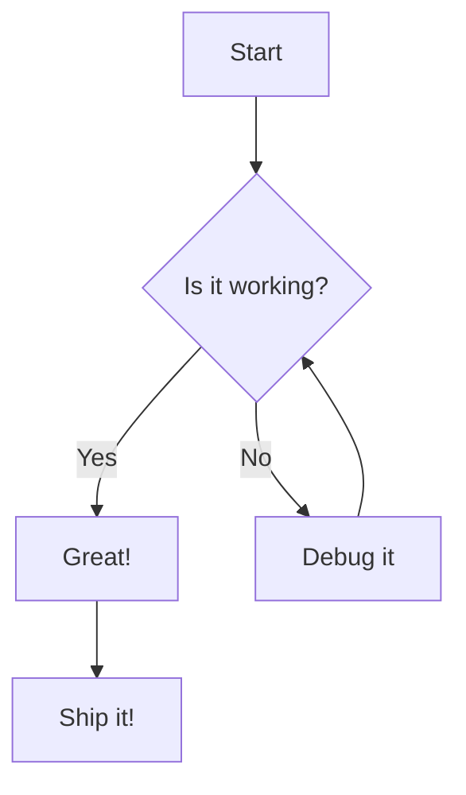

# Mermaid Live Editor

A modern, feature-rich live editor for Mermaid diagrams. Create, edit, and preview Mermaid diagrams with syntax highlighting, zoom controls, and file management - all running entirely in your browser with no backend required!

**[🚀 Live Demo](https://dedenbangkit.github.io/mermaid-live-editor/)**


## Features

### 🎨 **Modern Interface**
- Clean, responsive design with compact collapsible sidebar (256px)
- Side-by-side code editor and live preview
- Resizable panels to customize your workspace
- Minimal header with clean typography (Google Fonts: Inter & JetBrains Mono)
- Inline diagram title editing with rename icon
- Line separators for cleaner file list

### 📝 **Advanced Editor**
- Syntax highlighting with CodeMirror
- Line numbers and bracket matching
- Horizontal and vertical scrolling
- Auto-indentation and code formatting
- Real-time preview updates as you type

### 🔍 **Preview Controls**
- Zoom in/out with mouse wheel or buttons
- Pan by clicking and dragging
- Reset zoom to fit view
- Smooth zoom transitions

### 💾 **File Management**
- Save and load multiple diagram files
- Smart file sorting by last modified (most recent first)
- Detailed timestamps with relative time format (e.g., "5m ago", "2h ago")
- Quick rename with inline editing
- Delete files with confirmation
- Auto-save on rename or edit
- Persistent storage using IndexedDB (browser storage)

### 🌐 **No Backend Required**
- Runs entirely in your browser
- All data stored locally using IndexedDB
- No server setup or installation needed
- Works offline after first load
- Can be hosted on any static file server

### 📚 **Interactive Cheatsheet**
- Comprehensive examples of all Mermaid diagram types
- Opens in new tab (preserves your work in the editor)
- Clean sidebar navigation to jump to examples
- Live rendered diagrams with copy-to-clipboard functionality
- Matching theme and typography with main editor

## Quick Start

### Option 1: Open Locally
Simply open `index.html` in your web browser. That's it!

### Option 2: Run with Python HTTP Server
```bash
# Clone the repository
git clone https://github.com/dedenbangkit/mermaid-live-editor.git
cd mermaid-live-editor

# Start a simple HTTP server (Python 3)
python -m http.server 8000

# Or with Python 2
python -m SimpleHTTPServer 8000
```

Then open your browser and navigate to: `http://localhost:8000`

### Option 3: Use with Live Server (VS Code)
1. Install the "Live Server" extension in VS Code
2. Right-click on `index.html`
3. Select "Open with Live Server"

### Option 4: Deploy to Static Hosting
This application can be deployed to any static hosting service:
- **GitHub Pages**: Push to a repository and enable GitHub Pages
- **Netlify**: Drag and drop the folder to Netlify
- **Vercel**: Deploy with a single command
- **Cloudflare Pages**: Connect your repository
- Or any other static hosting provider

## Usage

### Creating Diagrams
1. Click the hamburger menu (☰) to toggle the sidebar
2. Click **New** button to create a new diagram
3. Click the rename icon (✏️) next to the diagram title to change the name
4. Write your Mermaid code in the editor
5. Watch the live preview update automatically
6. Click **Save** to store your diagram (or Ctrl/Cmd+S)

### Managing Files
- **Rename**: Click the pencil icon next to the diagram title, edit inline, press Enter or click outside to save
- **Open**: Click any file in the sidebar to open it (sorted by last modified)
- **Save**: Click the Save button to update the current diagram
- **Save As New**: Click the copy icon to duplicate the diagram
- **Delete**: Click the trash icon on any file in the list (hover to reveal)
- **New**: Click the New button to start a fresh diagram

### Keyboard Shortcuts
- **Ctrl/Cmd + S**: Save current diagram
- **Ctrl/Cmd + N**: Create new diagram
- **Ctrl/Cmd + B**: Toggle sidebar
- **Enter**: Confirm rename
- **Escape**: Cancel rename

### Navigation
- **Zoom**: Use the +/- buttons or mouse wheel in the preview
- **Pan**: Click and drag in the preview area
- **Reset**: Click the reset button (⛶) to fit the diagram
- **Resize**: Drag the divider between code and preview panels
- **Cheatsheet**: Click the "Cheatsheet" button to open examples in a new tab

## Supported Mermaid Diagrams

This editor supports all Mermaid diagram types:

- **Flowcharts** - Decision trees and process flows
- **Sequence Diagrams** - Interaction timelines
- **Gantt Charts** - Project timelines
- **Class Diagrams** - Object-oriented structures
- **State Diagrams** - State machines
- **Entity Relationship Diagrams** - Database schemas
- **User Journey** - User experience flows
- **Git Graphs** - Version control workflows
- **Pie Charts** - Data visualization
- **Requirement Diagrams** - System requirements

## Example

Here's a simple flowchart to get you started:



## Architecture

### Frontend-Only Application
- **index.html**: Main editor with clean, compact UI
- **cheatsheet.html**: Interactive examples and documentation
- **CodeMirror**: Syntax highlighting and editor features
- **Mermaid.js v10.6.1**: Diagram rendering engine
- **IndexedDB**: Browser-based persistent storage
- **Tailwind CSS (CDN)**: Utility-first styling
- **Google Fonts**: Inter (UI) & JetBrains Mono (code)
- **Vanilla JS**: No framework dependencies, no build process required

### Storage
- Files stored locally in your browser using IndexedDB
- Data persists across browser sessions
- Each browser/device has its own independent storage
- No server communication required
- Automatic tracking of creation and modification times

### Data Structure
Files are stored with the following structure:
```json
{
  "id": "file_timestamp",
  "name": "diagram_name",
  "content": "mermaid_code",
  "created": "ISO_8601_timestamp",
  "lastModified": "ISO_8601_timestamp"
}
```

### Project Structure
```
mermaid-live-editor/
├── index.html              # Main editor
├── cheatsheet.html         # Examples and documentation
├── assets/
│   ├── css/
│   │   └── styles.css      # Custom styles
│   ├── js/
│   │   └── app.js          # Application logic
│   └── icons/              # Favicons and app icons
│       ├── favicon.ico
│       ├── favicon-16x16.png
│       ├── favicon-32x32.png
│       ├── apple-touch-icon.png
│       ├── android-chrome-192x192.png
│       └── android-chrome-512x512.png
└── README.md
```

## Browser Compatibility

This application requires a browser with IndexedDB support:
- Chrome/Edge 24+
- Firefox 16+
- Safari 10+
- Opera 15+
- All modern mobile browsers

## Data Privacy

All your diagrams are stored **locally in your browser**. No data is ever sent to any server. Your diagrams stay on your device.

## Contributing

1. Fork the repository
2. Create your feature branch (`git checkout -b feature/AmazingFeature`)
3. Commit your changes (`git commit -m 'Add some AmazingFeature'`)
4. Push to the branch (`git push origin feature/AmazingFeature`)
5. Open a Pull Request

## License

This project is licensed under the MIT License - see the [LICENSE](LICENSE) file for details.

## Acknowledgments

- [Mermaid.js](https://mermaid.js.org/) - The amazing diagramming library
- [CodeMirror](https://codemirror.net/) - Excellent code editor component

## Support

If you find this project helpful, please consider giving it a ⭐ on GitHub!

For issues and feature requests, please use the [GitHub Issues](https://github.com/dedenbangkit/mermaid-live-editor/issues) page.
